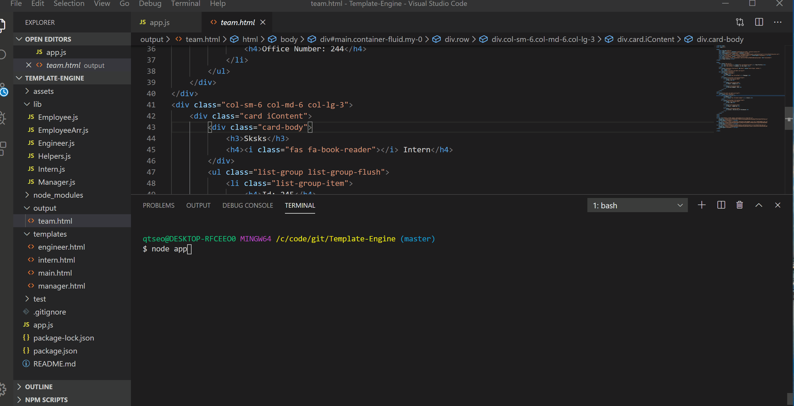

# Template-Engine
A software engineering team generator command line application.
 
Users are prompted for information of one manager :man_office_worker: and any number of engineers :woman_technologist: :man_technologist: and interns :man_student: :woman_student:

# Screenshots

# Tech/framework used
* Programming Languages: JavaScript, HTML, CSS
* CSS Framework: Bootstrap 4
* Platform/Framework: Node.js, npm
* Library/Package: Handlebars, Inquirer
* Other tools: Git, Visual Studio Code, Font Awesome, Google Fonts

# Setup
To run this project:
1. Clone to your computer :computer:
<pre> git clone https://github.com/schoe14/Template-Engine.git </pre>
2. Install packages :star2:
<pre> npm install </pre>
3. Command :+1:
<pre> node app </pre>